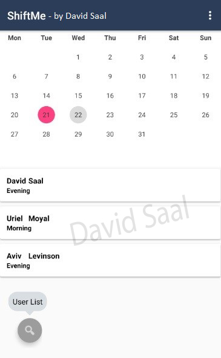

### Introduction
Shift manager app that syncs a real-time data from Firebase.
The application allows registration of a manager and employees
At any time, a user can watch his shifts that he was placed by the manager.
After registration, user transferred directly to the calendar screen where the
manager can select a day to add workers' shifts and every worker will be able
see who is working and on which day.
There also a settings menu where users can change account information,
their password, delete their account or sing out from the system.
The user list button displays a list of all the existing workers / managers in the
system and receiving information about them.

### Screenshots

